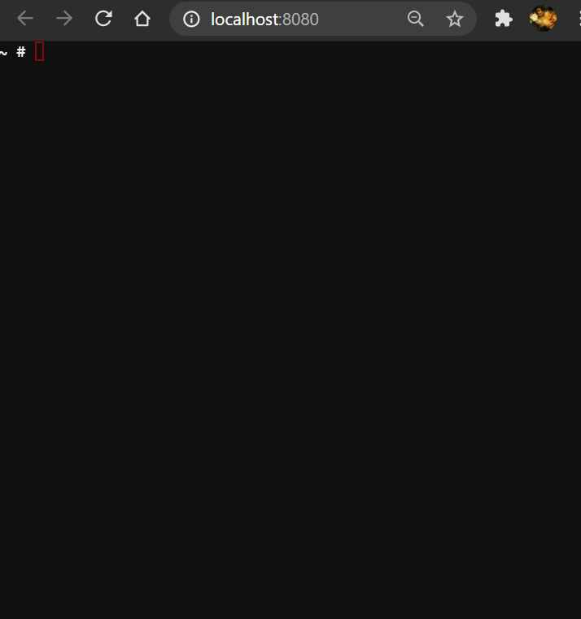

# What are the odds

## Disclaimer

This is my answer to the technical job interview from the Mystery Employer.
They ask me not to reveal their name here, because they don't want other to search and find a solution to their problem.
That is why I decided to call them the Mystery Employer in this repo.

Here is the link to the problem on their github. 
https://cutt.ly/eMCnAxW
I use an url shortener so nobody can find my repo by using the name of the employer.

## Introduction

Welcome to this repo, made by the Light Side Company.
This new firmware for C3PO and R2D2 was requested by the rebel fleet.

Their specifications may be found here : https://cutt.ly/eMCnAxW (technical interview of the Mystery Employer).

At the Light Side Company, we support any project that fights the empire. We use the force and technology to build applications.

As Lord Vader told himself : “The Ability To Destroy A Planet Is Insignificant Next To The Power Of The Force.”. So why not use this against them too ?

## Algorithm

This problem can be modeled with a graph.

So I re-watched this excellent video about the dijkstra algorithm :
https://www.youtube.com/watch?v=GazC3A4OQTE&ab_channel=Computerphile

My version does not need to build the hole graph (it builds it lazily). 
The graph is not simply the planet graph as given by the sqlite file,
since it would not be able to take time into account, and then it couldn't
avoid bounty hunters (or take that risk if no other choice).
So the index for the graph nodes is a (Planet, Fuel, Time) triplet.

I implemented the algorithm in GO, as a library imported by both the CLI and
the backend. For more information about my implementation for this specific problem,
you can read the many comments of the source code of **oddslib/**, and especially the
**dijkstra.go** file.

## Tests of the algorithm

Some unit tests have been written on the most
critical parts (for instance the dijkstra priority
queue).

The solving algorithm is tested against the examples provided in the rebel's specifications,
which act as integration tests.

## CLI

The R2D2 CLI has been release in GO. Its code is in the **cli** folder and
calls the lib from **oddslib** folder.

I have packaged the CLI into a sandbox container for testing in the browser.
It is hosted on a virtual private server (VPS) and I will remove it some day.
Feel free to play, here is the link : 

https://cli-misteryemployer.maxime-weyl-data.science/

It has continuous delivery through CapRover and the ./captain-definition file.

## Backend

The backend is a REST API written in GO in the **backend** folder. It uses the
same **oddslib** library. Since the API is really simple, I decided to stick with
REST over GraphQL.

The backend is documented with swagger, which can also be used to query the api,
and play with it.

The API has a single route (for doc, please check the swagger link): 

- POST ​/give-me-the-odds (Gives the odds of survival for a given problem)

The API is hosted on Google Cloud Platform, using their Cloud Run service.
You may experience a cold start, but then it becomes really quick.

The backend has continuous delivery on Google Cloud Platform's
Cloud Run, and the ./cloudbuild-backend.yaml and ./Dockerfile-backend files.

Swagger address is : 

https://misteryemployer-challenge-backend.maxime-weyl-data.science/api/v1/swagger/index.html

API address is :

https://misteryemployer-challenge-backend.maxime-weyl-data.science/api/v1

## Frontend

The Frontend was written with Angular, which I had to learn for this project.

It loads a file on the disk, and parse it client-side. If it is valid, it embeds it
into a JSON that is sent to the backend through a POST query.

On the first run, you may experience all cold start, but then it should become
very responsive.

The frontend has continuous delivery on Google Cloud Platform's
Cloud Run, and the ./cloudbuild-frontend.yaml and ./Dockerfile-frontend files.

Here is the URL for you to play with : https://misteryemployer-challenge-frontend.maxime-weyl-data.science/
